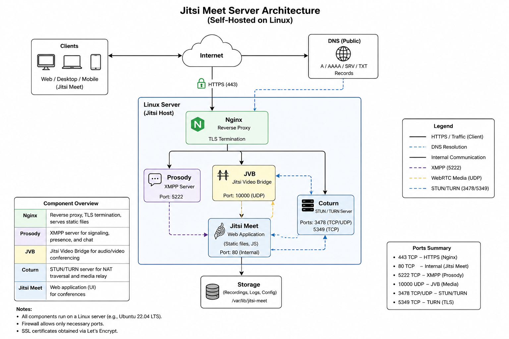

# jitsi-meet-server-project
Documentation of a self-hosted Jitsi Meet server deployment on Linux.

## Overview

This repository documents my experience deploying and maintaining a self-hosted Jitsi Meet environment.

## Architecture Diagram



## Project Goals

- Deploy a secure video conferencing platform
- Configure SSL certificates
- Manage DNS and domain settings
- Troubleshoot connectivity issues
- Evaluate recording and streaming options

## Technologies

- Linux
- Jitsi Meet
- Nginx
- Prosody
- Coturn
- Let's Encrypt

## Skills Demonstrated

- Linux System Administration
- Server Deployment
- DNS Management
- SSL Configuration
- Troubleshooting
- Technical Documentation

## Lessons Learned

This project improved my understanding of Linux server administration, real-time communication platforms, SSL management and system troubleshooting.

## Architecture

The Jitsi Meet setup consists of several services running on a Linux server.  
Nginx handles HTTPS traffic, Prosody manages XMPP signaling, JVB routes audio and video streams, and Coturn helps clients connect through NAT and firewalls.

# Troubleshooting Notes

This document collects typical issues encountered during the setup and operation of a self-hosted Jitsi Meet environment.

## Typical Issues

- DNS records not pointing to the correct server
- SSL certificate problems
- Firewall ports not open
- Audio or video connection problems
- NAT traversal issues with Coturn
- Service restart problems

## Useful Commands

```bash
systemctl status nginx
systemctl status prosody
systemctl status jitsi-videobridge2
systemctl status coturn
